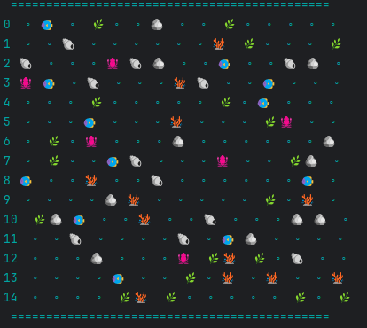

# Simulation
Пошаговая симуляция 2D мира, населённого травоядными и хищниками.

Карта игрового поля:

Аквариум населен хищниками 🦑 и травоядными 🐠.
Также на карте находятся статичные объекты - камни, трава, ракушки и кораллы.
Цель хищников и травоядных добраться до ресурсов кратчайшим путем.

Симуляцию можно запускать по одному ходу или запустить бксконечную симуляцию ходов.

 **Планы на проект:**

- Исправить просчет пути, чтобы Creature не ходили по клеткам, на которых находятся другие объекты
- Сделать очки здоровья и дальность перемещения функциональными
- Сделать размножение живтоных и травы